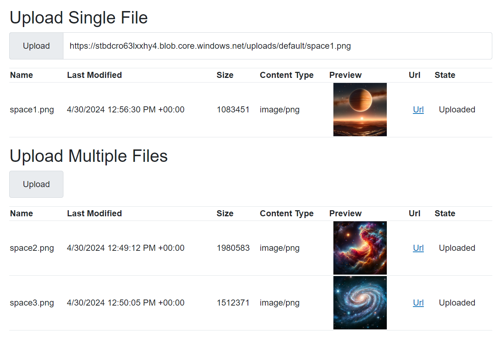

# Azure Blob Storage File Uploader

## Overview

This project provides a robust file uploader component that integrates seamlessly with Azure Blob Storage. It supports uploading multiple files, visualizing upload progress, and handling large files efficiently. This component is designed to be used in environments where files need to be stored securely and accessed globally.

## Features

- **Multiple File Uploads**: Users can select and upload multiple files simultaneously.
- **Progress Visualization**: Each file's upload progress is displayed with a visual progress bar.
- **Large File Support**: The uploader can handle large files, with the default maximum size set to 2 GiB, but is configurable to support larger sizes.
- **File Type Icons**: Automatically displays icons for different file types like images or videos.
- **Azure Blob Integration**: Direct integration with Azure Blob Storage for backend storage.

## Dependencies

- `Azure.Storage.Blobs`: SDK for accessing Azure Blob Storage.

## Provision and Deploy to Azure

1. Install Azure Developer CLI (https://aka.ms/azd-install)
1. Run `azd up`.  This will provision an app service and storage account and set the AZURE_STORAGE_ENDPOINT user secret to run locally and the variable in the app service.
1. Go to the endpoint that azd outputs and try uploading a file.

## Run Locally

1. Open the solution in Visual Studio
1. Hit F5. 

## Usage

1. **Embed the Component**: Place the component in your Blazor server-side application.
2. **Customize Parameters**: Adjust parameters like `MaximumFileCount`, `Folder`, and `BlobContainer` to fit your needs.

## Parameters

| Parameter               | Description                                                                 | Default Value                |
|-------------------------|-----------------------------------------------------------------------------|------------------------------|
| `BlobContainer`         | The Azure Blob Storage container where files are uploaded.                  | `"uploads"`                  |
| `Folder`                | The default folder path where files will be uploaded.                       | `"default"`                  |
| `MaximumFileCount`      | The maximum number of files that can be uploaded at once.                   | `5`                          |
| `PreviewWidth`          | The width in pixels used for preview images or icons.                       | `100`                 |
| `MaximumFileSize`       | Maximum file size allowed for uploads, specified in bytes.                  | `2 GiB (2,147,483,648 bytes)`|
| `InitialTransferSize`   | Initial size of upload chunk, specified in bytes.                           | `4 MiB (4,194,304 bytes)`    |
| `MaximumTransferSize`   | Maximum size of a transfer chunk, specified in bytes.                       | `4 MiB (4,194,304 bytes)`    |
| `MaximumConcurrency`    | Maximum number of concurrent operations during transfer.                    | `2`                          |
| `SingleUrl`             | The URL of the single uploaded file. This allows you to pre-populate the single file upload box.                                      | `""` (empty string)          |

## Event Handling

- **OnSingleUrlChanged**: Triggered when the URL of a single uploaded file changes.
- **OnUploadFilesChanged**: Triggered when the list of uploaded files changes.

## Custom Progress Handler

A custom progress handler class is included to monitor the upload progress and update the UI accordingly. This class uses the IProgress interface to track progress.

## Utilities

- **FileHelper**: A utility class to determine file types based on extensions and format file sizes for display.

## Future Enhancements

- **Security**: Integration with Azure Defender for scanning uploaded files for malware.
- **Performance Optimization**: Further optimization of chunk sizes and concurrency for faster uploads.

This uploader is ideal for applications requiring high-level management of file uploads, including progress tracking and direct integration with Azure Blob Storage.
